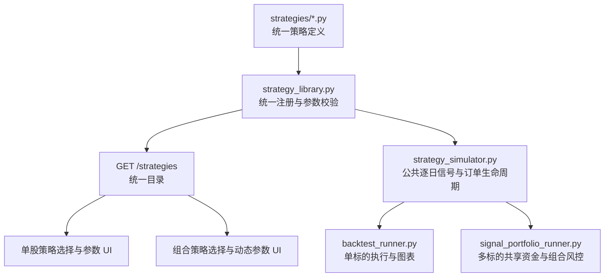

# 统一单股与多股票信号组合策略引擎设计

**状态：** 已确认

**日期：** 2026-07-12

**决策：** 完全重写现有单股策略，使单股回测和多股票信号组合回测使用同一套策略定义与交易语义。

## 1. 背景

当前项目有两套彼此独立的策略体系：

- 单股回测通过动态发现 `strategies/*.py` 中继承 `backtesting.Strategy` 的类，策略参数另存在 `strategy_metadata.py`。
- 多股票信号组合回测只支持内嵌于 `signal_portfolio_runner.py` 的“趋势回调 Pin Bar”，拥有单独的参数模型、指标计算、入场、退出和仓位逻辑。

这导致三个问题：

1. `/strategies` 只代表单股策略，组合页面没有真正的策略目录。
2. 相同交易思想若要同时支持单股和组合，必须维护两套代码，容易产生语义漂移。
3. 新增组合策略需要修改请求模型、runner 和硬编码 UI，不能只通过增加策略模块完成。

本次重写建立一个统一策略目录。目录中的全部策略都能运行于单股和多股票信号组合模式；组合页面仍保留股票池、策略参数、资金和组合风控配置。

## 2. 目标与非目标

### 目标

- 七个策略全部进入统一目录：现有六个单股策略，加上趋势回调 Pin Bar。
- 单股和组合模式调用同一个策略配置模型、指标准备函数、入场判断和退出判断。
- `/strategies` 成为唯一策略目录 API，并明确返回支持的执行模式。
- 组合页面根据目录元数据动态渲染所选策略的参数控件。
- 新增策略只需要增加一个策略模块及其测试，不需要修改 `main.py`、组合请求联合类型或 HTML 参数模板。
- 保持现有 `/backtest`、`/optimize`、`/optimization/jobs`、`/signal-portfolio-backtest/jobs` 路由和主要响应结构。
- 保持 A 股标的限制、共享现金、整手交易、涨跌停检查、T+1、滑点和交易成本。
- 所有信号在当日收盘数据完成后产生，最早下一交易日成交，禁止未来函数。

### 非目标

- 不引入多股票轮动、权重优化或新的组合选择模型。
- 不改变当前固定/自动股票池能力。
- 不在本次重写中增加做空、融资、盘中分钟级撮合或跨市场标的。
- 不保证重写前后每一笔成交完全相同；保证交易规则和指标含义一致，并通过行为测试锁定新的统一语义。

## 3. 核心架构



### 3.1 统一策略定义

新增 `strategy_engine.py`，定义与执行器无关的领域对象：

```python
@dataclass(frozen=True)
class EntryIntent:
    order_type: Literal["next_open", "stop_next_bar"]
    strength: float = 0.0
    trigger_price: float | None = None
    expires_after_bars: int = 1
    suggested_position_pct: float = 1.0
    risk: RiskIntent | None = None
    metadata: dict[str, Any] = field(default_factory=dict)


@dataclass(frozen=True)
class StrategyDecision:
    entry: EntryIntent | None = None
    exit: ExitIntent | None = None
    next_state: Mapping[str, Any] | None = None


@dataclass(frozen=True)
class StrategyDefinition:
    strategy_id: str
    display_name: str
    description: str
    config_model: type[BaseModel]
    parameters: tuple[StrategyParamMeta, ...]
    prepare_frame: Callable[[pd.DataFrame, BaseModel], pd.DataFrame]
    evaluate: Callable[[StrategyBarContext], StrategyDecision]
```

其中 `RiskIntent` 至少包含 `stop_price`、`target_price`、`risk_per_share` 和 `risk_budget_pct`；`ExitIntent` 包含 `reason` 与 `order_type="next_open"`；`min_history_bars` 是接收已验证配置并返回整数的 callable，因此预热长度可以随参数变化。

`StrategyBarContext` 只暴露截至当前日期的 frame 前缀、已成交持仓、持仓期、最高价、只读策略私有状态和已验证配置。策略不能访问未来行，也不直接修改现金或下单。冷却期、突破线等私有状态通过 `StrategyDecision.next_state` 返回完整的新状态，由执行器在判断结束后原子替换；策略不得原地修改 context。

`prepare_frame` 虽然为性能接收完整 DataFrame，但契约要求严格因果：不得使用负向 `shift`、居中窗口或任何未来行。每个策略都必须通过“前缀不变性”测试：在日期 T 之后追加或修改数据，不得改变 T 及以前的指标和判断。

每个 `strategies/*.py` 模块导出一个 `STRATEGY_DEFINITION`。`strategy_library.py` 负责发现、注册、去重、按 ID 查询、参数验证以及生成 API 元数据。Pydantic 配置模型负责跨字段校验；`StrategyParamMeta` 负责 UI 标签和优化搜索候选。注册时校验两者的字段与默认值一致，避免第三份参数真相源。

为避免循环依赖，`StrategyParamMeta` 与核心契约一起定义在 `strategy_engine.py`；`strategy_metadata.py` 只保留向后兼容的查询函数和重导出，不被核心库反向导入。

### 3.2 公共模拟器

新增 `strategy_simulator.py`，集中实现：

1. 对每个标的调用策略的 `prepare_frame`，只预计算指标，不预计算依赖持仓状态的退出结果。
2. 建立所有标的的联合交易日历。
3. 每个交易日依次执行：更新持仓期、执行已生效的保护性止损/止盈和上一日退出挂单、按当前权益更新回撤闸门、在闸门允许时执行入场挂单、当日收盘后策略判断、生成下一日挂单、记录权益。
4. `next_open` 挂单在下一可交易日开盘尝试成交；`stop_next_bar` 挂单仅在下一交易日触及触发价时成交，且受最大跳空限制。
5. 卖出遵守 T+1 和跌停限制，买入遵守涨停、整手、现金和组合仓位限制。
6. `suggested_position_pct` 明确定义为“成交前组合权益的目标占比”，不是剩余现金占比。若策略同时给出每股风险和 `risk_budget_pct`，风险预算也以成交前组合权益为基数；执行器在建议仓位、风险预算仓位、组合单票上限、剩余总敞口和可用现金之间取最小值。

执行前先解析并验证策略配置，再调用 `min_history_bars(config)`；股票池扫描的最少历史 K 线取用户配置和策略要求的较大值，避免先加载数据后才发现预热不足。

策略收盘退出使用 `ExitIntent(order_type="next_open")`，下一可交易日开盘成交。成交时附带的 `RiskIntent` 由执行器使用日内 OHLC 检查，并从 T+1 开始生效：跳空越过止损时按更差的开盘价成交；跳空越过止盈时按目标价成交；同一根 K 线同时触及止损和止盈时按保守原则先执行止损。移动止损在当日收盘后更新，下一交易日起生效。

单股与组合调用同一模拟器：

- 单股模式传入一个标的、`max_positions=1`，使用 API 的 `initial_cash` 和 `commission`，返回现有 `BacktestResult` 结构。
- 组合模式传入股票池和共享资金配置，返回现有 `SignalPortfolioBacktestResult` 结构。

单股图表改由项目自身生成价格、买卖点与权益曲线 HTML，不再依赖 `Backtest.plot()`。核心指标统一从权益曲线和已平仓交易计算，再交给 `analytics.extract_core_metrics()` 生成 Phase 2.0 score。

如果最终移除生产代码对 `backtesting` 的依赖，`bokeh` 必须先成为 `requirements.txt` 的直接依赖，不能依赖旧包的传递安装。

## 4. 策略迁移语义

| 策略 ID | 入场挂单 | 退出规则 | 建议仓位 |
|---|---|---|---|
| `boll_macd_breakout` | 信号后下一开盘 | 固定止损/止盈，T+1 起生效 | `position_pct` |
| `macd_volume_divergence_risk_control` | 信号后下一开盘 | 死叉、红柱衰减、趋势线、固定/移动风控、持仓期 | `position_pct` |
| `ma_breakout_atr_risk_control` | 信号后下一开盘 | MA20、ATR 移动止损、弱趋势超期 | ATR 风险仓位 |
| `rsi_risk_control` | 信号后下一开盘 | RSI、趋势线、固定风控、持仓期；退出后冷却 | `position_pct` |
| `ma_trend_risk_control` | 信号后下一开盘 | 均线死叉、固定风控、持仓期 | `position_pct` |
| `volume_breakout_risk_control` | 信号后下一开盘 | 跌破突破线、固定风控、持仓期 | `position_pct` |
| `trend_pullback_pin_bar` | 下一交易日突破 Pin Bar 高点 | 结构/ATR 止损、R 倍止盈、连续两日弱趋势 | 风险预算仓位 |

所有策略保留当前指标公式和参数默认值。趋势回调 Pin Bar 新增为单股策略；其市场宽度参数不属于单股信号本身，迁移到组合级 `market_filter`。通用市场宽度独立定义为“当日有效股票中收盘价高于各自 `breadth_ma_period` 日简单均线的比例”，默认周期 60，不依赖任何策略产生的指标列。单股运行时不应用市场宽度过滤，组合运行时该过滤器可作用于任意策略。

## 5. 请求、API 与兼容性

### 5.1 `/strategies`

继续返回数组，保留现有字段并增加执行能力：

```json
{
  "name": "rsi_risk_control",
  "display_name": "RSI风控策略",
  "description": "...",
  "class_name": "evaluate_rsi",
  "parameters": [],
  "engine": "unified",
  "supported_modes": ["single_stock", "signal_portfolio"]
}
```

七个策略的 `supported_modes` 均包含两种模式。为兼容现有客户端，`class_name` 在本次重写中保留，但改为统一定义中 evaluator 的实现名称，并通过新增的 `engine="unified"` 明确它不再表示 `backtesting.Strategy` 子类。

### 5.2 单股请求

`/backtest` 继续使用：

```json
{
  "strategy_name": "rsi_risk_control",
  "strategy_params": {"rsi_period": 14}
}
```

参数先由统一目录验证，再进入模拟器。优化器继续提交同样的 `strategy_name` 与参数组合，因此无需改变对外模型。

### 5.3 组合请求

组合策略采用稳定的嵌套结构：

```json
{
  "strategy": {
    "strategy_name": "rsi_risk_control",
    "parameters": {"rsi_period": 14, "rsi_buy": 30}
  }
}
```

为兼容当前页面和已有调用，后端继续接受旧的 Pin Bar 扁平结构，并转换为 `parameters`；旧对象中的三个市场宽度字段转换到 `market_filter`。如果请求同时提供旧市场宽度字段和新 `market_filter`，返回 400，避免静默决定优先级。旧格式在当前 0.x 版本线内不移除，未来只能在有明确 breaking-release 说明时删除。API 响应中的 `config` 统一输出新结构。未知策略、未知参数、错误类型和跨字段冲突返回 400，不进入后台任务。

## 6. UI 设计

“多股票信号组合回测”面板继续保留，新增 `signalStrategy` 下拉框。页面只请求一次 `/strategies`，同时填充单股与组合策略选择器。

组合参数区域不再硬编码 Pin Bar 输入框，改为复用通用参数控件渲染器：

- 根据 `parameters` 创建 number、checkbox 或 text 控件。
- 使用独立 DOM 前缀，避免与单股参数控件冲突。
- 切换策略时使用目录默认值重建控件。
- 提交时收集为 `strategy.parameters`。
- 策略说明随选择更新。

股票池、初始资金、最大持仓数、单票上限、目标仓位、日期、数据源和交易规则仍属于组合面板。市场宽度过滤作为组合覆盖层保留独立配置，并适用于所有策略。

## 7. 错误处理与可观测性

- 策略注册失败在应用启动时明确报错，不静默吞掉模块异常。
- 请求提交前验证策略与参数，后台任务只接收已经标准化的配置。
- 策略计算异常包含策略 ID、标的和日期，但不包含密钥或完整行情数据。
- `scan_diagnostics` 增加 `strategy_id`、策略名称、信号数、挂单过期数、组合限制拦截数和市场过滤拦截数。
- 结果 `config` 保存实际运行的默认值补全后参数，确保回测可复现。

## 8. 测试与验收

### 单元测试

- 注册表发现七个策略，ID 唯一，配置模型与参数元数据一致。
- 每个策略分别覆盖一个入场、一个主要退出和一个参数边界。
- 公共模拟器覆盖下一开盘、突破挂单、挂单过期、T+1、涨跌停、整手、共享现金、持仓上限、回撤闸门先于入场、同 K 止损优先和无未来函数。
- 每个策略通过 frame 与 decision 的前缀不变性测试，证明追加未来行情不会改变历史输出。

### 集成测试

- 每个策略都能通过 `/backtest` 完成单股回测。
- 每个策略都能通过组合 runner 在两个标的上完成回测。
- `/strategies` 返回七个双模式策略。
- 组合 API 拒绝未知策略和参数，并接受旧 Pin Bar 请求。
- UI 测试验证组合策略下拉框、动态参数控件和新请求结构。

### 完成标准

- 全部既有测试与新增测试通过。
- 单股和组合 runner 不再包含具体策略名称分支或 Pin Bar 指标实现。
- `main.py` 不再维护第二份策略注册信息。
- 新增一个示例测试策略时，无需修改 runner、API 路由或 HTML 即可出现在两种模式中。

## 9. 风险与迁移控制

- **成交时点变化：** 统一规定收盘产生信号、下一交易日成交，并用回归测试固定。
- **指标预热差异：** 每个策略定义显式声明所需历史长度；测试覆盖边界首日。
- **单股统计变化：** 保留响应键和 Phase 2.0 score 口径，在发布说明中记录引擎变化，不伪装成与旧 Backtesting.py 完全等价。
- **重写范围大：** 按“协议 → 单个策略样板 → 公共模拟器 → 全策略迁移 → runner → UI”分阶段提交，每一步保持测试可运行。
- **迁移期双接口：** 在公共模拟器接管 runner 前，策略模块暂时保留调用同一纯函数的 Backtesting.py 薄包装；七个统一定义全部就绪并完成 runner 切换后，原子删除薄包装和旧发现逻辑。
- **旧请求兼容：** 旧 Pin Bar 扁平配置在当前 0.x 版本线内保留，内部立即标准化；新旧市场宽度格式同时出现时明确拒绝。
